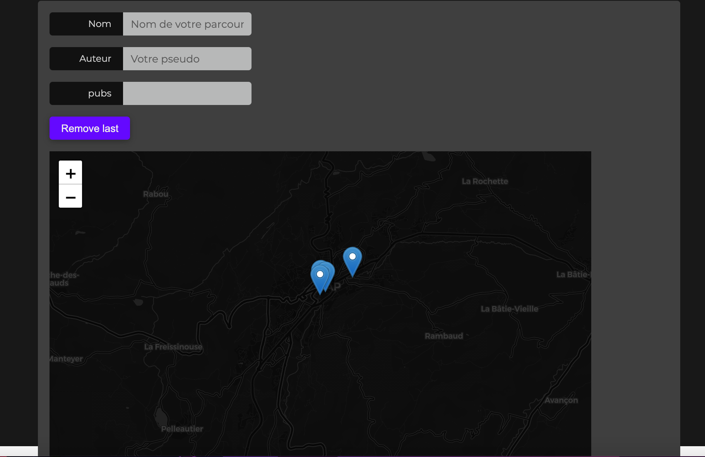
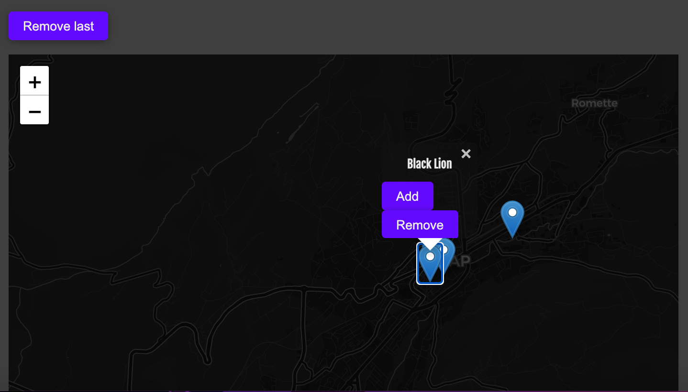
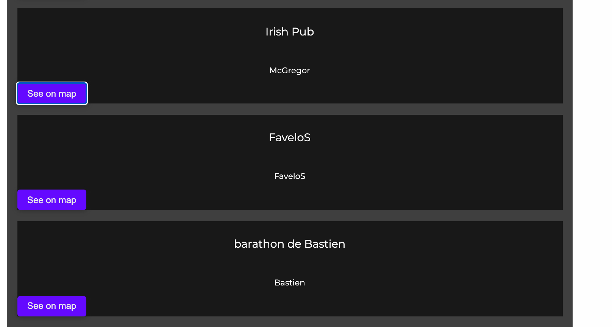
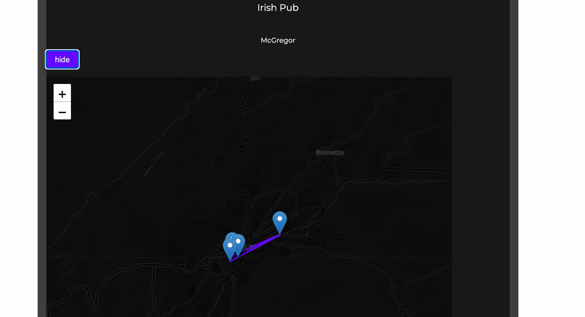

# Barathons

Application web réaliser en **React** et **TypeScript**

Nous avons tout d'abord crée l'API avec NodeJs voir : https://github.com/Skiiners06/APIBarathon

Puis ensuite développé les différentes fonctionnalitées : 

  - ajouter différents bar à un barathon via des marqueurs sur la carte (OpenStreetMap)
  
  - Création de parcours (barathon) => laision des marqueurs sur la carte entre eux.
  
  
  **Inferface web :**
  l'utilisateur peut :
    - saisir le nom du parcour qu'il compte créer
    - saisir son nom (Auteur)
    - sélectionner sur la carte les bars qu'il souhaite ajouté a son parcour
  
  
  
  
  
  
  En dessous de l'interface de création de barathon voici la liste des barathons crée : 
  
  
  
  
  **Losrque l'on clique sur le bouton "see on map", le parcour de ce barathon apparait sur une carte :**
  
  
  
  On peut cliquer sur le bouton "hide" pour cacher l'affichage du parcour sur la carte.
  
